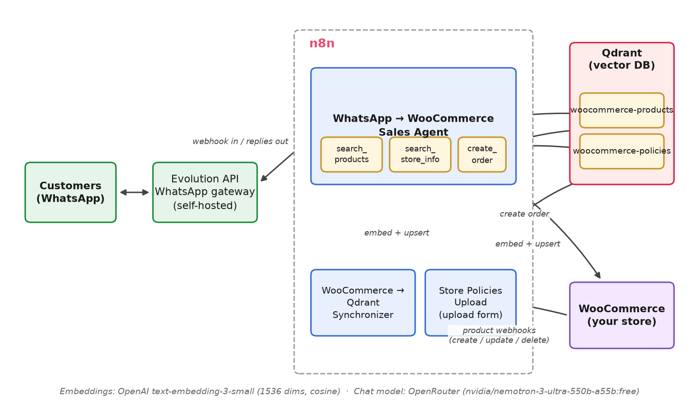

# WhatsApp ↔ WooCommerce AI Sales Agent (n8n)

An n8n-based WhatsApp sales assistant for a WooCommerce store. Customers chat with your
WhatsApp number; an AI agent searches your catalog and store documents in Qdrant,
recommends products, answers policy questions, and creates pending orders in WooCommerce
after customer confirmation.

## Architecture

Three independent n8n workflows, one per folder:

| Folder | Workflow | Purpose |
|---|---|---|
| [`whatsapp-woocommerce-sales-agent/`](whatsapp-woocommerce-sales-agent/README.md) | WhatsApp → WooCommerce Sales Agent | The customer-facing chatbot: receives WhatsApp messages via Evolution API, searches Qdrant, replies, creates orders |
| [`woocommerce-qdrant-synchronizer/`](woocommerce-qdrant-synchronizer/README.md) | WooCommerce → Qdrant Synchronizer | Keeps the `woocommerce-products` products collection in sync with the WooCommerce catalog |
| [`store-policies-upload/`](store-policies-upload/README.md) | Store Policies Upload | Upload form that vectorizes store policies/FAQ into the `woocommerce-policies` collection |

## Services needed

- **n8n** — workflow host
- **Evolution API** — self-hosted WhatsApp gateway ([docs](https://doc.evolution-api.com/v2/en/get-started/introduction))
- **Qdrant Cloud** — vector DB, free tier ([cloud.qdrant.io](https://cloud.qdrant.io/))
- **OpenAI** — `text-embedding-3-small` embeddings ([API keys](https://platform.openai.com/api-keys))
- **OpenRouter** — chat LLM, e.g. `nvidia/nemotron-3-ultra-550b-a55b:free` ([API keys](https://openrouter.ai/settings/keys))
- **WooCommerce** — REST API keys ([docs](https://woocommerce.github.io/woocommerce-rest-api-docs/))

Both Qdrant collections use **1536 dimensions / Cosine** to match
`text-embedding-3-small`.

## Setup order

1. **Qdrant Synchronizer** — create the cluster + `woocommerce-products` collection, connect
   WooCommerce, run the FULL RESYNC. → [README](woocommerce-qdrant-synchronizer/README.md)
2. **Store Policies Upload** — create the `woocommerce-policies` collection, protect
   the form, upload your documents. → [README](store-policies-upload/README.md)
3. **Sales Agent** — wire OpenRouter, embeddings, Qdrant, WooCommerce and Evolution API,
   regenerate the secret webhook path, activate. → [README](whatsapp-woocommerce-sales-agent/README.md)

Each folder's README has the full step-by-step configuration for its workflow, including
the credentials to create in n8n and `curl` snippets for the Qdrant collections.

## Environment

Copy `.env.example` to `.env` for your n8n deployment basics (encryption key, public URL,
service endpoints). **API keys are not stored there** — they live as native n8n
credentials configured in the n8n UI.
