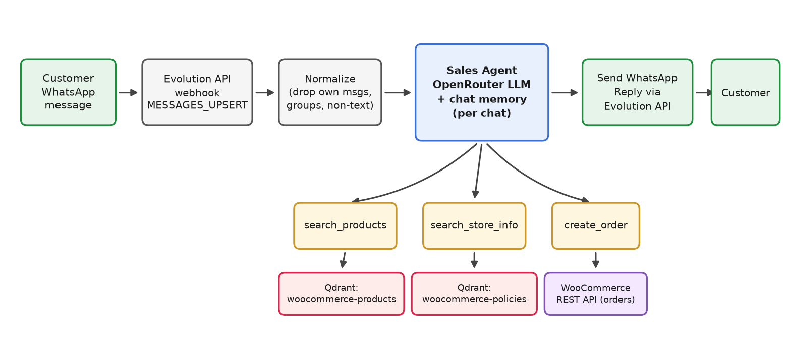

# WhatsApp → WooCommerce Sales Agent

An AI sales assistant on WhatsApp. Customers message your WhatsApp number, the agent
answers in their language, searches your product catalog and store policies in Qdrant,
recommends in-stock products, and — after explicit confirmation — creates a real
**pending/unpaid** order in WooCommerce.

**Workflow file:** `WhatsApp → WooCommerce Sales Agent.json`

## What it does



- Replies in whatever language the customer's **latest** message uses.
- Never invents products, prices or IDs — only uses `search_products` results.
- Only recommends items with `stock_status = instock`.
- Orders are always created as `pending` / unpaid, tagged `lead_channel: whatsapp`.
- Per-chat memory (12-message window) keyed by WhatsApp chat ID.

## Prerequisites / subscriptions

| Service | What you need | Cost |
|---|---|---|
| n8n | Running instance with LangChain nodes | — |
| [OpenRouter](https://openrouter.ai/) | API key (chat model) | Free tier available |
| [OpenAI](https://platform.openai.com/) | API key (`text-embedding-3-small`) | Pay-per-use |
| [Qdrant Cloud](https://cloud.qdrant.io/) | Cluster with the two collections below | Free tier |
| [Evolution API](https://github.com/EvolutionAPI/evolution-api) | Self-hosted WhatsApp gateway | Free (self-hosted) |
| WooCommerce | REST API key with **Write** permission | Free |

> This workflow depends on the two collections being populated first — set up the
> [Qdrant Synchronizer](../woocommerce-qdrant-synchronizer/README.md) and the
> [Store Policies Upload](../store-policies-upload/README.md) workflows before going live.

## 1. Qdrant collections used by the agent

The agent searches two collections (create them as shown in the other READMEs):

| Collection | Vector size | Distance | Used by tool | Filled by |
|---|---|---|---|---|
| `woocommerce-products` | 1536 | Cosine | `search_products` | WooCommerce → Qdrant Synchronizer |
| `woocommerce-policies` | 1536 | Cosine | `search_store_info` | Store Policies Upload |

Both must match OpenAI `text-embedding-3-small` (1536 dims). Create them with:

```bash
for col in woocommerce-products woocommerce-policies; do
  curl -X PUT "https://YOUR-CLUSTER.cloud.qdrant.io:6333/collections/$col" \
    -H "api-key: YOUR_QDRANT_API_KEY" \
    -H "Content-Type: application/json" \
    -d '{ "vectors": { "size": 1536, "distance": "Cosine" } }'
done
```

In n8n, create a **Qdrant API** credential (cluster URL + API key) and attach it to
**search_products** and **search_store_info**, then select the correct collection in each
node's *Qdrant Collection* dropdown.

## 2. OpenRouter (chat model)

1. Sign up at [openrouter.ai](https://openrouter.ai/) and create a key at
   [openrouter.ai/settings/keys](https://openrouter.ai/settings/keys).
2. In n8n: create an **OpenRouter API** credential with that key.
3. Open the **OpenRouter Chat Model** node and attach the credential. The workflow ships
   with this free model preselected — keep it, or pick another:

```
nvidia/nemotron-3-ultra-550b-a55b:free
```

The `:free` variant costs nothing on OpenRouter's free tier. You can swap it for any other
OpenRouter model later ([model list](https://openrouter.ai/models)) — just keep it
reasonably strong at tool calling, since the agent relies on three tools.

## 3. OpenAI embeddings

1. Create a key at [platform.openai.com/api-keys](https://platform.openai.com/api-keys).
2. Create an **OpenAI** credential in n8n and attach it to **Embeddings OpenAI** and
   **Embeddings OpenAI2** (one feeds `search_products`, the other `search_store_info`).
3. Model on both: **`text-embedding-3-small`** — it must be the same model the
   collections were built with, or search results will be garbage.

## 4. WooCommerce API key (order creation)

1. **WooCommerce → Settings → Advanced → REST API → Add key**.
2. Permissions: **Write** — enough to create orders, and if the key ever leaks it cannot
   dump your customer list.
3. Create a **WooCommerce API** credential in n8n (store URL, consumer key/secret) and
   attach it to the **create_order** tool node.
4. In **create_order**, replace the placeholder URL
   `https://your-store.com/wp-json/wc/v3/orders` with your real store domain.

Docs: [WooCommerce REST API — Orders](https://woocommerce.github.io/woocommerce-rest-api-docs/#orders).

## 5. Evolution API (WhatsApp connection)

Evolution API is an open-source, self-hosted WhatsApp gateway (Baileys-based).

1. **Deploy it** — easiest with Docker:
   [Evolution API docs](https://doc.evolution-api.com/v2/en/get-started/introduction) ·
   [GitHub repo](https://github.com/EvolutionAPI/evolution-api). A minimal
   `docker-compose.yml` is provided in their docs; note the `AUTHENTICATION_API_KEY` you set.
2. **Create an instance** (e.g. named `whatsapp`) via the manager UI or:

```bash
curl -X POST "http://your-evolution-host:8080/instance/create" \
  -H "apikey: YOUR_GLOBAL_API_KEY" \
  -H "Content-Type: application/json" \
  -d '{ "instanceName": "whatsapp", "integration": "WHATSAPP-BAILEYS" }'
```

3. **Connect the number**: fetch the instance's QR code
   (`GET /instance/connect/whatsapp`) and scan it with the WhatsApp phone you want the
   bot to answer from.
4. **Copy the instance's API key** (returned at creation, or via
   `GET /instance/fetchInstances`).
5. In n8n, create an **HTTP Header Auth** credential:
   - Name: `apikey`
   - Value: the instance API key
   Attach it to the **Send WhatsApp Reply** node.
6. In **Send WhatsApp Reply**, update the URL host if Evolution is not reachable as
   `http://evolution-api:8080` from n8n (e.g. `http://localhost:8080` or your server IP).
   The `{{ ... instance }}` part is filled automatically from the incoming webhook payload.

## 6. Wire the webhook (secret URL — read this)

The **WhatsApp Inbound** webhook path is the only thing protecting your bot — anyone who
knows the full URL can fake customer messages and create real orders.

1. **Regenerate the path before going live** (don't keep the template's path):

```bash
openssl rand -hex 10
```

Paste the result into **WhatsApp Inbound → Path**.
2. Copy the node's **Production URL**
   (`https://your-n8n/webhook/<your-path>`).
3. Register it in Evolution so incoming messages reach n8n:

```bash
curl -X POST "http://your-evolution-host:8080/webhook/set/whatsapp" \
  -H "apikey: YOUR_GLOBAL_API_KEY" \
  -H "Content-Type: application/json" \
  -d '{
    "webhook": {
      "url": "https://your-n8n/webhook/YOUR-SECRET-PATH",
      "enabled": true,
      "webhookByEvents": false,
      "events": ["MESSAGES_UPSERT"]
    }
  }'
```

Only `MESSAGES_UPSERT` is needed. If you ever change the path in n8n, update Evolution at
the same time or the bot goes silent.

## 7. Activate and test

1. Attach all credentials: OpenRouter, OpenAI (×2), Qdrant (×2), WooCommerce,
   Evolution header auth.
2. Make sure the Synchronizer has run a FULL RESYNC and at least one policy is uploaded.
3. **Activate** the workflow.
4. Send a WhatsApp message to the connected number from a different phone, e.g.
   "do you have a cordless drill?" — the agent should search the catalog and reply with
   up to 3 in-stock options with prices.
5. Ask "what's your return policy?" — it should answer from your uploaded documents.
6. Confirm an order end-to-end and check it appears in WooCommerce as **pending**.

## Security checklist (from the canvas note)

- [ ] Regenerated the webhook path — never shared publicly.
- [ ] Upload Form (policies workflow) protected with Basic Auth.
- [ ] WooCommerce key is **Write**, not Read/Write.
- [x] Already built in: orders are always pending/unpaid, customers cannot inject prices
      or status, and the agent ignores instructions hidden inside messages or documents.
